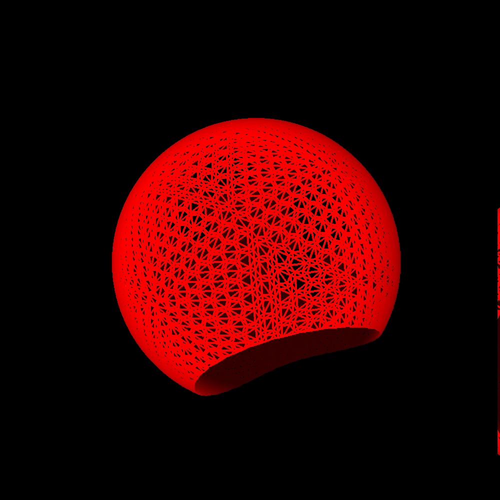

# Simulating Left Atrial Arrhythmias with an Interactive N-body Model

### Front View ---- Back View ---- View Through the Mitral Valve
</img>
</img>
</img>
### Flutter Between Pulmonary Veins ---- Roof Flutter ---- Micro-reentry
</img>
</img>
</img>

### Project Aims

Our project has several key objectives. Firstly, we aim to utilize N-body techniques to develop an interactive model of the left atrium. This model will allow users to manipulate various parameters in real-time, facilitating the induction and observation of common arrhythmias.

Secondly, we seek to create a training and study tool for electrophysiologists, researchers, and medical students. Through accurately simulating left atrial arrhythmias and their treatment using simulated ablations, the model will serve as a valuable educational resource, enhancing understanding and skill development in this critical medical field.

Additionally, the project aims to advance research in electrophysiology by providing a platform for exploring novel treatment strategies and studying arrhythmia mechanisms. This could lead to new insights and innovations in the field, ultimately benefiting patients with cardiac arrhythmias.

In summary, the project's objectives include developing a cutting-edge model for arrhythmia simulation, providing an advanced training tool for medical professionals, and advancing research in electrophysiology.

### Table of Contents
- [Installation](#installation)
  - [Hardware Requirements](#hardware-requirements)
  - [Software Requirements](#software-requirements)
  - [Building](#building)
- [Running](#running)
- [Controls](#controls)
- [Units of Measurement](#UnitsofMeasurement)
- [Changelog](#changelog)
- [Contributing](#contributing)
- [Citation](#citation)

## Background
Heart disease and strokes are the leading causes of death worldwide [1,2].
Supraventricular Tachycardia (SVT) is a significant contributing factor to strokes, heart
failure, and, in some cases, acute myocardial infarction [3-5]. Therefore, it is imperative
that, in our pursuit of building healthier lives free of cardiovascular diseases and strokes,
we focus on reducing the occurrence of SVT.
SVT encompasses all cardiac arrhythmias in which the underlying mechanism
sustaining the abnormal heartbeat originates above the ventricles. This abnormal
heartbeat can disrupt the natural synchronization between the atria and the ventricles,
disturbing the laminar blood flow through the heart and causing it to stagnate in the small
finger-like appendage of the left atrium (LA). Consequently, this allows for the formation
of certain types of lethal blood clots known as mural thrombi, which can become dislodged
and travel to the brain or coronary arteries, resulting in a stroke or heart attack [6]. It is
this mechanism that leads individuals with atrial fibrillation (AF) to experience a five-fold
increased risk of stroke [7].
In a normally functioning heart, the sinus node serves as the pacemaker, consistently
producing an electrical impulse to dictate the heart’s rhythm and rate. This electrical

impulse initiates a chain reaction that propagates throughout the heart, generating a life-
sustaining heartbeat. Ectopic electrical impulses can lead to chain reactions occurring at

the wrong place and time, disrupting the normal sinus rhythm. This disruption may cause
the atria to flutter, beat out of sync with the ventricles, or present a myriad of other
undesirable outcomes [8].

In many cases, SVT can be successfully controlled with medication and lifestyle
changes. However, some of these drugs are challenging for patients to tolerate, and
certain medications with the most established efficacy are known to be hepatotoxic,
causing deleterious side effects [9]. Hence, catheter ablation, though more invasive than
medication therapy, has proven to be the most reliably efficacious and safest method
physicians have for treating patients with recurring SVT [10-13].
Radiofrequency (RF) catheter ablation and three-dimensional electro-anatomical
mapping techniques have seen dramatic improvement over the last 10 years, enabling
doctors to perform procedures on beating hearts that were, until recently, thought
impossible [14,15]. However, much is still not understood about what causes heart
arrhythmias and how to use RF catheter ablation to treat them [16]. What would assist
doctors, researchers, and medical students is a way to rapidly and inexpensively test out
ideas and observe outcomes. We have created an N-body computer model of the LA to
do just this.
The LA was chosen because it is the site where most complex arrhythmias arise [17-
20]. The model captures both electrical and mechanical activity. Users can adjust the
model down to the individual muscle level and introduce ectopic events. Note: In this text
when we refer to a muscle, we mean a group of cardiomyocytes. These tools can be used
to induce arrhythmias in the LA that can be eliminated through simulated ablations. All of
these actions can be performed interactively in a running simulation, enabling users to
set up conditions in the simulated LA, test ablation strategies, and observe the outcomes.

## Installation
### Hardware Requirements:
- This simulation requires a CUDA-enabled GPU from Nvidia. Click <a href="https://developer.nvidia.com/cuda-gpus">here </a> for a list of GPUs.

| *Note: These are guidelines, not rules | CPU                            | GPU                   | RAM       |
|----------------------------------------|--------------------------------|-----------------------|-----------|
| Minimum:                               | AMD/Intel Six-Core Processor   | Any CUDA-Enabled GPU  | 16GB DDR4 |
| Recommended:                           | AMD/Intel Eight-Core Processor | RTX 3090/Quadro A6000 | 32GB DDR5 |

### Software Requirements:

#### Disclosure: This simulation only works on Linux-based distros currently. All development and testing was done in Ubuntu 20.04/22.04

#### This Repository contains the following:
- [Nsight Visual Studio Code Edition](https://developer.nvidia.com/nsight-visual-studio-code-edition)
- [CUDA](https://developer.nvidia.com/cuda-downloads)
   - OpenGL
        - [Nvidia Driver For OpenGL](https://developer.nvidia.com/opengl-driver)
        - [OpenGL Index](https://www.khronos.org/registry/OpenGL/index_gl.php)
#### Linux (Ubuntu/Debian)
  Install Nvidia CUDA Toolkit:

    sudo apt install nvidia-cuda-toolkit

  Install Mesa Utils:

    sudo apt install mesa-utils

### Building (Note: this must be done after every code change)

  Navigate to the cloned folder and run the following command to build and compile the simulation:

    ./compile

## Running
  After compiling, run the simulation:

    ./run
  
## Setup File 

### Units of Measurement
   	Length is in millimeters (mm)
   	Time is in milliseconds (ms)
   	Mass is in grams (g)
   
### New Run or Previous Run
   	You can start a new run using the nodes and muscles files, or you can continue a previous run.
   	NodesMusclesFileOrPreviousRunsFile = 0, run from the selected nodes and muscles file
   	NodesMusclesFileOrPreviousRunsFile = 1, run from a previous run file
   
   	If you selected 0, then you must set 
   	InputFileName = ***;
   	to the name of the nodes and muscles file you want to run from the list below. 
   	{Line11, Circle24, CSphere340, CSphere5680, IdealLeftAtrium13.0KNotTriangle, LeftAtriumRealRemovedAppendage}
   
   	If you selected 1, then you must set 
   	PreviousRunFileName = ***;
   	to the name of a previous run file you saved in the PreviousRunsFile folder. The three previous run files listed below
   	are alredy placed in this folder to use as demos. 
   	{PVFlutterDemo, MicroReentryDemo, RoofFlutterDemo}
   
### Nodes and Muscle View Size, and colors
   	You can set the size of the nodes and muscles with the
   	LineWidth = ***;
   	NodeRadiusAdjustment = ***;
   
   	Colors to help distinguish between simulation events can all be customized at the end of the setup file. 
   
   	Note: This only affects the viewing of the simulation; no actual functionality is changed with these parameters.

### Simulation Constants

   	Myocyte Force Per Mass strength = 596.0 mm/ms^2
   	BloodPressure = 80.0; millimeters of merculry converted to g/(mm*ms*ms) in the program.
   	MassOfAtria = 25; g
   	RadiusOfAtria = 17.8; mm
   	BaseMuscleRelaxedStrength = 2.0; This is just a force that helps the model keep its shape.
   	BaseMuscleCompresionStopFraction = 0.7 This only lets a muscle fiber reduce its length by 30%
   	BeatPeriod = 1000.0; (ms)
   	MaxNumberOfperiodicEctopicEvents = 50; This just sets an upper limit to the number ectopic beats a simulation can have.
   	Note: ectopic beats are extra pulse node that the user sets in an active simulation. Ectopic triggers are single events
   	stimulated by mouse clicks.
   
   	The above are typical values and are all changable in the setup file. These values are read in at the start of a simulation. 
   	They are not changable once the simulation starts. 
   
### Simulation Variables
   	BaseMuscleContractionDuration = 200.0; (ms)
   	BaseMuscleRechargeDuration = 200.0; (ms)
   	BaseMuscleConductionVelocity = 0.5; (mm/ms)
   
   	The above are typical values read in from the setup file at the start of a simulation. These values are all changable in an active simulation.
   
### Timing constants
   	PrintRate = 100.0; How often the program prints new information to the terminal screen. 
   	DrawRate = 1000; How often the program draws a new simulation picture. 
   	Dt = 0.001; How many Leap-Frog iterations are done for each ms of simulation time.
   
## Controls
  
  

## Changelog

Refer to the changelog for details.

## License
  - This code is protected by the MIT License and is free to use for personal and academic use.

## Contributing
  - Dr. Bryant Wyatt (PI)
  - Mr. Gavin McIntosh
  - Mr. Avery Campbell
  - Mr. Derek Hopkins
  - Ms. Leah Rogers
  - Ms. Melanie Little

## References
  
	[1] World Health Organization. (12/9/2020). The top 10 causes of death. World Health Organization. https://www.who.int/news-room/fact-sheets/detail/the top-10-causes-of-death
	[2] Virani SS, Alonso A, Aparicio HJ, Benjamin EJ, Bittencourt MS, Callaway CW, Carson AP, Chamberlain AM, Cheng S, Delling FN, Elkind MSV, Evenson KR, Ferguson JF, Gupta DK, Khan SS, Kissela BM, Knutson KL, Lee CD, Lewis TT, Liu J, Loop MS, Lutsey PL, Ma J, Mackey J, Martin SS, Matchar DB, Mussolino ME, Navaneethan SD, Perak AM, Roth GA, Samad Z, Satou GM, Schroeder EB, Shah SH, Shay CM, Stokes A, VanWagner LB, Wang NY, Tsao CW; American Heart Association Council on Epidemiology and Prevention Statistics Committee and Stroke Statistics Subcommittee. Heart Disease and Stroke Statistics-2021 Update: A Report From the American Heart Association. Circulation. 2021 Feb 23;143(8):e254-e743. doi: 10.1161/CIR.0000000000000950. Epub 2021 Jan 27. PMID: 33501848.
	[3] Brundel BJJM, Ai X, Hills MT, Kuipers MF, Lip GYH, de Groot NMS. Atrial fibrillation. Nature Reviews Disease Primers. 2022;8(1):21–21.
	[4] Staerk L, Sherer JA, Ko D, Benjamin EJ, Helm RH. Atrial Fibrillation. Circulation Research. 2017;120(9):1501–1517.
	[5] Pellman J, Sheikh F. Atrial fibrillation: mechanisms, therapeutics, and future directions. Comprehensive Physiology. 2015.
	[6] Beigel R, Wunderlich NC, Ho SY, Arsanjani R, Siegel RJ. The left atrial appendage: anatomy, function, and noninvasive evaluation. JACC Cardiovasc Imaging. 2014 Dec;7(12):1251-65. doi: 10.1016/j.jcmg.2014.08.009. PMID: 25496544.
	[7] Singleton MJ, Imtiaz-Ahmad M, Kamel H, O'Neal WT, Judd SE, Howard VJ, Howard G, Soliman EZ, Bhave PD. Association of Atrial Fibrillation Without Cardiovascular Comorbidities and Stroke Risk: From the REGARDS Study. J Am Heart Assoc. 2020 Jun 16;9(12):e016380. doi: 10.1161/JAHA.120.016380. Epub 2020 Jun 4. PMID: 32495723; PMCID: PMC7429041.
	[8] Antzelevitch C, Burashnikov A. Overview of Basic Mechanisms of Cardiac Arrhythmia. 2011.
	[9] Long MT, Ko D, Arnold LM, Trinquart L, Sherer JA, Keppel SS, Benjamin EJ, Helm RH. Gastrointestinal and liver diseases and atrial fibrillation: a review of the literature. Therap Adv Gastroenterol. 2019 Apr 2;12:1756284819832237. doi: 10.1177/1756284819832237. PMID: 30984290; PMCID: PMC6448121.
	[10] Carlo P, Giuseppe A, Simone S, Filippo G, Gabriele V, Simone G, Gabriele P, Patrizio M, Nicoleta S, Isabelle G, Andreina S, Laura L, Nicola P, Andrea R, Francesco M, et al. A Randomized Trial of Circumferential Pulmonary Vein Ablation Versus Antiarrhythmic Drug Therapy in Paroxysmal Atrial Fibrillation. Journal of the American College of Cardiology. 2006;48(11):2340–2347.
	[11] Charitakis E, Metelli S, Karlsson LO, Antoniadis AP, Rizas KD, Liuba I, Almroth H, Hassel Jönsson A, Schwieler J, Tsartsalis D, Sideris S, Dragioti E, Fragakis N, Chaimani A. Comparing efficacy and safety in catheter ablation strategies for atrial fibrillation: a network meta-analysis. BMC Medicine. 2022;20(1):193–193.
	[12] Cheng E, Liu C, Yeo I, Markowitz S, George T, Ip J, Kim LK, Lerman BB. Risk of Mortality Following Catheter Ablation of Atrial Fibrillation. Journal of the American College of Cardiology. 2019;74(18):2254–2264.
	[13] Mujović N, Marinković M, Lenarczyk R, Tilz R, Potpara TS. Catheter Ablation of Atrial Fibrillation: An Overview for Clinicians. Advances in Therapy. 2017;34(8):1897–1917.
	[14] Cappato R, Calkins H, Chen S-A, Davies W, Iesaka Y, Kalman J, Kim Y-H, Klein G, Natale A, Packer D, Skanes A, Ambrogi F, Biganzoli E. Updated Worldwide Survey on the Methods, Efficacy, and Safety of Catheter Ablation for Human Atrial Fibrillation. Circulation: Arrhythmia and Electrophysiology. 2010;3(1):32–38.
	[15] Ganesan AN, Shipp NJ, Brooks AG, Kuklik P, Lau DH, Lim HS, Sullivan T, Roberts-Thomson KC, Sanders P. Long-term Outcomes of Catheter Ablation of Atrial Fibrillation: A Systematic Review and Meta-analysis. Journal of the American Heart Association. 2013;2(2).
	[16] Quah JX, Dharmaprani D, Lahiri A, Tiver K, Ganesan AN. Reconceptualising Atrial Fibrillation Using Renewal Theory: A Novel Approach to the Assessment of Atrial Fibrillation Dynamics. Arrhythmia & Electrophysiology Review 2021;10(2):77–84. 2021.
	[17] Markides V, Schilling RJ. Atrial fibrillation: classification, pathophysiology, mechanisms and drug treatment. Heart. 2003 Aug;89(8):939-43. doi: 10.1136/heart.89.8.939. PMID: 12860883; PMCID: PMC1767799.
	[18] Wyndham CRC. Atrial Fibrillation: The Most Common Arrhythmia. Texas Heart Institute Journal. 2000;27(3):257–257.
	[19] Cheniti G, Vlachos K, Pambrun T, Hooks D, Frontera A, Takigawa M, Bourier F, Kitamura T, Lam A, Martin C, Dumas-Pommier C, Puyo S, Pillois X, Duchateau J, Klotz N, et al. Atrial Fibrillation Mechanisms and Implications for Catheter Ablation. Frontiers in Physiology. 2018;9.
	[20] Gussak G, Pfenniger A, Wren L, Gilani M, Zhang W, Yoo S, Johnson DA, Burrell A, Benefield B, Knight G, Knight BP, Passman R, Goldberger JJ, Aistrup G, Wasserstrom JA, Shiferaw Y, Arora R. Region-specific parasympathetic nerve remodeling in the left atrium contributes to creation of a vulnerable substrate for atrial fibrillation. JCI Insight. 2019 Oct 17;4(20):e130532. doi: 10.1172/jci.insight.130532. PMID: 31503549; PMCID: PMC6824299.
	[21] Niederer SA, Lumens J, Trayanova NA. Computational models in cardiology. Nature Reviews Cardiology. 2019;16(2):100–111.
	[22] Potse M. Scalable and Accurate ECG Simulation for Reaction-Diffusion Models of the Human Heart. Front Physiol. 2018 Apr 20;9:370. doi: 10.3389/fphys.2018.00370. PMID: 29731720; PMCID: PMC5920200.
	[23] Sellami H, Cazenille L, Fujii T, Hagiya M, Aubert-Kato N, Genot AJ. Accelerating the Finite-Element Method for Reaction-Diffusion Simulations on GPUs with CUDA. Micromachines (Basel). 2020 Sep 22;11(9):881. doi: 10.3390/mi11090881. PMID: 32971889; PMCID: PMC7569852.
	[24] Trayanova NA. Whole-heart modeling: applications to cardiac electrophysiology and electromechanics. Circulation research. 2011;108(1):113–128.
	[25] Cristian Barrios Espinosa, Jorge Sanchez, Olaf Dossel, Axel Loewe. Diffusion Reaction Eikonal Alternant Model: Towards Fast Simulations of Complex Cardiac Arrhythmias. Computing in Cardiology 2022; Vol 49
	[26] Makowiec D, Wdowczyk J, Struzik ZR. Heart Rhythm Insights Into Structural Remodeling in Atrial Tissue: Timed Automata Approach. Front Physiol. 2019 Jan 14;9:1859. doi: 10.3389/fphys.2018.01859. PMID: 30692928; PMCID: PMC6340163.
	[27] Cox BN, Snead ML. Cells as strain-cued automata. J Mech Phys Solids. 2016 Feb;87:177-226. doi: 10.1016/j.jmps.2015.11.002. Epub 2015 Dec 2. PMID: 31178602; PMCID: PMC6550492.
	[28] Billy J. Fournier, Bryant M. Wyatt. (2016). Matter and GPUs: Should the Focus of Our Modeling Classes be Adjusted?. Pearson Publishing, Boston, Ma: International Conference on Technology in Collegiate Mathematics.
	[29] Conway, J. H. (1970). The game of life. Scientific American, 223(4), 4-23.
	[30] Helbing, D. (2012). Agent-Based Modeling. In: Helbing, D. (eds) Social Self- Organization. Understanding Complex Systems. Springer, Berlin, Heidelberg. https://doi.org/10.1007/978-3-642-24004-1_2
	[31] T. J. Sego ,James P. Sluka,Herbert M. Sauro,James A. Glazier. Tissue Forge: Interactive biological and biophysics simulation environment. PLOS Computational Biology | https://doi.org/10.1371/journal.pcbi.1010768 October 23, 2023
	[32] Greenspan D. N-body Problems and Models. World Scientific; 2004.
	[33] Greenspan D. Molecular and Particle Modeling of Laminar and Turbulent Flows. World Scientific; 2005.
	[34] Bryant M. Wyatt, Jonathan M. Petz, William J. Sumpter, Ty R. Turner, Edward L. Smith, Baylor G. Fain, Taylor J. Hutyra, Scott A. Cook, John H. Gresham, Michael F. Hibbs, Shaukat N. Goderya (2018). Creating an Isotopically Similar Earth-Moon System with Correct Angular Momentum from a Giant Impact. Journal of Astrophysics and Astronomy, 39(2) 26:1-6.
	[35] Justin C. Eiland, Travis C. Salzillo, Brett H. Hokr, Justin L. Highland, William D. Mayfield, Bryant M. Wyatt. (2014). Lunar-forming Giant Impact Model Utilizing Modern Graphics Processing Units. Journal of Astrophysics and Astronomy, 35(4), 607-618.
	[36] Greenspan D. Quasimolecular Modelling. World Scientific; 1991.
	[37] Bryant M. Wyatt. (1994). Collisions of Microdrops of Water. Computers & Mathematics with Applications, 28 (10-12), 175-208.
	[38] Jaryd Domine, Hakiem Grant, Wyatt Young, Rajesh Vuddandam, Bryant Wyatt. N-body Adaptive Optimization of Lattice Towers. GPU Technology Conference. San Jose, CA,(2020).https://www.nvidia.com/content/dam/en-zz/Solutions/gtc/conference- posters/gtc2020-posters/Design_Engineering_01_P21881_Jaryd_Domine_Web.pdf
	[39] Greenspan D. Arithmetic Applied Mathematics. PERGAMON PRESS; 1980.
	[40] Greenspan D. Numerical Solution of Ordinary Differential Equations for Classical, Relativistic and Nano Systems. WILEY-VCH Verlag GmbH & Co. KGaA; 2006..
	[41] Edward Angel. OpenGL: A Primer. 2002. Addison-Wesley
	[42] Yu-ki Iwasaki, Kunihiro Nishida, Takeshi Kato and Stanley Nattel. Atrial Fibrillation Pathophysiology. Circulation. 2011 | Volume 124, Issue 20: 2264–2274
	[43] Printables. left atrium of the heart: print for occluder implantation feasibility. https://www.printables.com/model/16719-left-atrium-of-the-heart-print-for-occluder-implan
	[44] Farber R. CUDA Application Design and Development. CUDA Application Design and Development. 2011.
	[45] Jason Sands, J., and Kandrot,E. (2010). CUDA by Example: An Introduction to General-Purpose GPUProgramming, Pearson Education, Inc..
	[46] Hwu, W. (2011). GPU Computing Gems (Emerald Ed.)Elsevier Inc., Boston, MA.
	[47] Sellers, G. W. R. H. N. (2014). OpenGL SuperBible.Addison Wesley, Boston, MA.
      

The Particle Modeling Group reserves the right to change this policy at any time.
