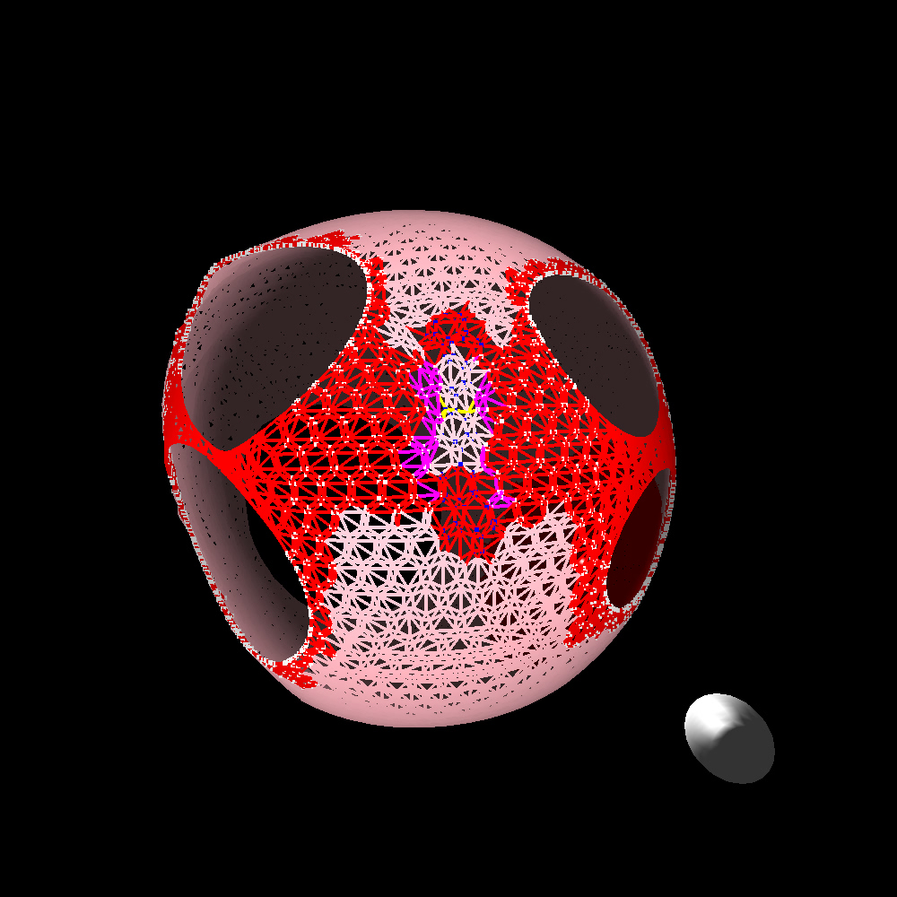

</img>
</img>
</img>
</img>
</img>
</img>

# Simulating Left Atrial Arrhythmias with an Interactive N-body Modeling

This project utilizes N-body techniques to create an interactive model of the left atrium. Users can establish conditions in a live simulation to induce common arrhythmias. These arrhythmias can be observed and studied in the model, and subsequently eliminated using simulated ablations. We aim for this model to serve as a training and research tool for electrophysiologists, researchers, and medical students.

### Table of Contents
- [Installation](#installation)
  - [Hardware Requirements](#hardware-requirements)
  - [Software Requirements](#software-requirements)
  - [Building](#building)
- [Running](#running)
- [Controls](#controls)
- [Units of Measurement](#UnitsofMeasurement)
- [Changelog](#changelog)
- [Contributing](#contributing)
- [Citation](#citation)

## Installation
### Hardware Requirements:
- This simulation requires a CUDA-enabled GPU from Nvidia. Click <a href="https://developer.nvidia.com/cuda-gpus">here </a> for a list of GPUs.

| *Note: These are guidelines, not rules | CPU                            | GPU                   | RAM       |
|----------------------------------------|--------------------------------|-----------------------|-----------|
| Minimum:                               | AMD/Intel Six-Core Processor   | Any CUDA-Enabled GPU  | 16GB DDR4 |
| Recommended:                           | AMD/Intel Eight-Core Processor | RTX 3090/Quadro A6000 | 32GB DDR5 |

### Software Requirements:

#### Disclosure: This simulation only works on Linux-based distros currently. All development and testing was done in Ubuntu 20.04/22.04

#### This Repository contains the following:
- [Nsight Visual Studio Code Edition](https://developer.nvidia.com/nsight-visual-studio-code-edition)
- [CUDA](https://developer.nvidia.com/cuda-downloads)
   - OpenGL
        - [Nvidia Driver For OpenGL](https://developer.nvidia.com/opengl-driver)
        - [OpenGL Index](https://www.khronos.org/registry/OpenGL/index_gl.php)
#### Linux (Ubuntu/Debian)
  Install Nvidia CUDA Toolkit:

    sudo apt install nvidia-cuda-toolkit

  Install Mesa Utils:

    sudo apt install mesa-utils

### Building (Note: this must be done after every code change)

  Navigate to the cloned folder and run the following command to build and compile the simulation:

    ./compile

## Running
  After compiling, run the simulation:

    ./run

### Controls

  - Use the terminal to set your basic parameters (Circle or sphere and number of divisions).
  The simulation will be paused at the start. Move to the mouse over the simulation window and type the following commands.
  
  
  
  
## Units of Measurement

    Length is in millimeters
    Time is in milliseconds
    Mass is in grams
    Viscosity is in grams/(millimeters * milliseconds^2)

     Unit Constants
        Fiber length 100 micrometers or 0.1 millimeters
        Action Potential Speed .5 meters/sec
        Muscle Compression Fraction is 30 percent
        Contraction Duration is ~100 milliseconds
        Relaxation Duration is ~200 milliseconds
        Short Axis Circumference is 200 millimeters
        

## Changelog

Refer to the changelog for details.

## License
  - This code is protected by the MIT License and is free to use for personal and academic use.

## Contributing
  - Dr. Bryant Wyatt (PI)
  - Mr. Gavin McIntosh
  - Mr. Avery Campbell
  - Mr. Derek Hopkins
  - Ms. Leah Rogers
  - Ms. Melanie Little

## Citation
  
      Dubin D. Ion Adventure in the Heartland: Exploring the Heart's Ionic-Molecular Microcosm. 
      Tampa, Florida: Cover Publishing; 2015.
      
      Dubin D. Rapid Interpretation of EKG's: ... an Interactive Course. 6th ed. 
      Fort Myers, Florida: Cover Publishing Company; 2007.
      
      Wynsberghe DV, Carola R, Noback CR. Human Anatomy and Physiology. 3rd ed. 
      London: McGraw-Hill; 1995.
      
      Klabunde RE. Cardiovascular Physiology Concepts. 
      Philadelphia, Pennsylvania: Wolters Kluwer; 2021. 
      
      Bozkurt S. (2019). Mathematical modeling of cardiac function to evaluate clinical cases in adults and children. 
      PloS one, 14(10), e0224663. https://doi.org/10.1371/journal.pone.0224663
      
      Lodish H, Berk A, Zipursky SL, et al. Molecular Cell Biology. 4th edition. 
      New York: W. H. Freeman; 2000. Section 18.4, Muscle: A Specialized Contractile Machine. 
      Available from: https://www.ncbi.nlm.nih.gov/books/NBK21670/
      
      Karki DB, Pant S, Yadava SK, Vaidya A, Neupane DK, Joshi S. 
      Measurement of right atrial volume and diameters in healthy Nepalese with normal echocardiogram. 
      Kathmandu Univ Med J (KUMJ). 2014;12(46):110-112. doi:10.3126/kumj.v12i2.13655
      
      Irie T, Kaneko Y, Nakajima T, et al. Electroanatomically estimated length
      of slow pathway in atrioventricular nodal reentrant tachycardia. Heart Vessels.
      2014;29(6):817-824. doi:10.1007/s00380-013-0424-0
      

The Particle Modeling Group reserves the right to change this policy at any time.
